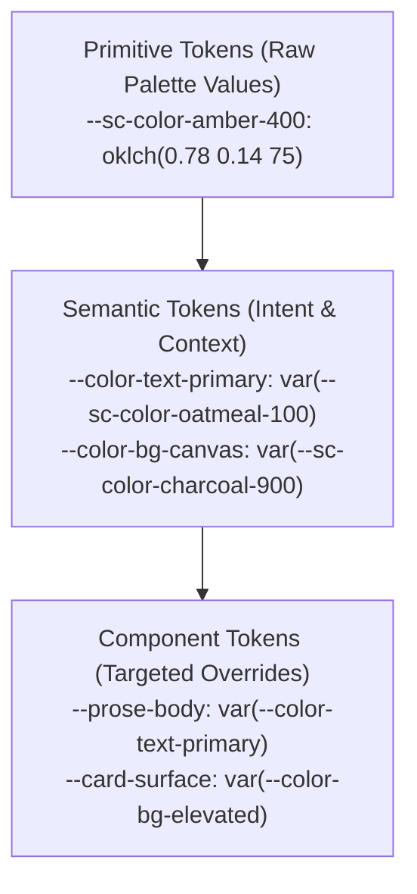

# SoftContrast: Anti-Halation Reading Palettes & Perceptual Accessibility Architecture

## Authoritative Sources
- [Myndex Research. APCA (SAPC-APCA) documentation.](https://git.apcacontrast.com/)
- [Myndex/SAPC-APCA canonical repository (GitHub).](https://github.com/Myndex/SAPC-APCA)
- [Myndex/apca-w3 — W3/AGWG-licensed reference implementation.](https://github.com/Myndex/apca-w3)
- [van den Berg TJTP. "Scattering, straylight, and glare." *Handbook of Visual Optics*. Taylor & Francis.](https://www.taylorfrancis.com/chapters/edit/10.1201/9781315373034-33/scattering-straylight-glare-thomas-van-den-berg)

> Note: APCA's documentation prohibits use in medical/clinical/human-safety applications without a written licence from Myndex. SoftContrast is a readability aid, not a clinical tool.
## Comprehensive Technical & Clinical Research Dossier

**Author:** Vision Apps Research Subagent  
**Date:** September 2026  
**Document Target:** `/home/paulk/Desktop/Hosted-Services/Vision Apps/research/softcontrast-research.md`  
**Purpose:** Foundational technical, clinical, and architectural research for **SoftContrast**, an anti-halation reading palette generator leveraging the Accessible Perceptual Contrast Algorithm (APCA), OKLCH color science, and cross-browser userstyle/userscript injection.

---

## Executive Summary

Visual accessibility on the web has long been governed by the mathematical simplifications of WCAG 2.0/2.1 contrast ratios (e.g., the standard 4.5:1 ratio). While well-intentioned, these formulas rely on a symmetric, flat luminance difference that fails to model human visual perception, spatial frequency, or display physics. For populations with astigmatism, high myopia, age-related macular degeneration (AMD), and photophobia, standard high-contrast dark modes (`#000000` background with `#FFFFFF` text) induce a severe degradation known as **optical halation** (irradiation blur, ghosting, and intraocular flare).

**SoftContrast** resolves this dilemma by replacing naive contrast ratios with the **Accessible Perceptual Contrast Algorithm (APCA)** and utilizing the **OKLCH** color space (CSS Color Module Level 4) to generate anti-halation reading palettes. By combining warm, low-melanopic color temperatures with calibrated background luminance (e.g., Midnight Ochre `#141416` with Oatmeal text `#d6d0c4`), SoftContrast eliminates halation bloom while preserving crisp, suprathreshold reading acuity ($L_c \ge 60\text{--}75$).

---

## Table of Contents

1. [APCA (Accessible Perceptual Contrast Algorithm)](#1-apca-accessible-perceptual-contrast-algorithm)
   - 1.1 Limitations of WCAG 2.1 Contrast Ratios
   - 1.2 Mathematical Derivation & Power-Law Architecture
   - 1.3 Polarity Asymmetry (BoW vs. WoB)
   - 1.4 Spatial Frequency and the Font Matrix (`fontLookupAPCA`)
   - 1.5 Current W3C Standardization Status & Bridge PCA (BPCA)
2. [Halation & Glare in Low-Vision Populations](#2-halation--glare-in-low-vision-populations)
   - 2.1 Optical Mechanics of Halation & The Irradiation Effect
   - 2.2 Astigmatism, Corneal Irregularities, and Pupil Mydriasis
   - 2.3 High Myopia and Retinal Degradation
   - 2.4 Age-Related Macular Degeneration (AMD) & Photostress
   - 2.5 The Failure of Traditional High-Contrast Modes
3. [Background & Foreground Color Temperatures for Extended Reading](#3-background--foreground-color-temperatures-for-extended-reading)
   - 3.1 Longitudinal Chromatic Aberration (LCA) in the Human Eye
   - 3.2 Melanopic Lux and ipRGC Trigeminal Photophobia Pathways
   - 3.3 Clinical Comparison: Warm vs. Cool Tones
   - 3.4 Ergonomic Reading Luminance & Clamping Thresholds
4. [CSS Custom Properties: Architecture & User Overrides](#4-css-custom-properties-architecture--user-overrides)
   - 4.1 Three-Tier Token Architecture (Primitive, Semantic, Component)
   - 4.2 Exposing Theme Tokens for User Configuration
   - 4.3 Specificity & Cascade Layer Isolation (`@layer`)
   - 4.4 Non-Destructive Cross-Site DOM Overrides
5. [Stylus & Tampermonkey Userscript/Userstyle APIs](#5-stylus--tampermonkey-userscriptuserstyle-apis)
   - 5.1 Stylus UserCSS Metadata Specification & `@var` Directives
   - 5.2 Tampermonkey / Violentmonkey Architecture & `GM_addStyle`
   - 5.3 Eliminating Flash of Unstyled/White Content (FOAC) at `document-start`
   - 5.4 Content Security Policy (CSP) Bypasses and Best Practices
6. [OKLCH Color Space for Perceptually Uniform Palettes](#6-oklch-color-space-for-perceptually-uniform-palettes)
   - 6.1 Deficiencies of sRGB, HSL, and CIELAB
   - 6.2 The Structure of OKLCH (CSS Color Module Level 4)
   - 6.3 CSS Gamut Mapping Algorithm (Section 13)
   - 6.4 Algorithmic Accessible Ramp Generation in OKLCH
7. [Comparative Review of Open-Source Accessibility Tools](#7-comparative-review-of-open-source-accessibility-tools)
   - 7.1 Adobe Leonardo (`@adobe/leonardo-contrast-colors`)
   - 7.2 Myndex Polychrom
   - 7.3 Huetone
   - 7.4 Accessible Palette
   - 7.5 Color.js & Culori
   - 7.6 Feature Comparison Matrix
8. [Cross-Tool Export Formats & Interoperability](#8-cross-tool-export-formats--interoperability)
   - 8.1 W3C Design Tokens Community Group (DTCG) Specification
   - 8.2 CSS Custom Properties & Tailwind CSS v4 `@theme`
   - 8.3 Stylus UserCSS / Tampermonkey Bundle
   - 8.4 URL Hash State Serialization
9. [Primary Source Citations & References](#9-primary-source-citations--references)

---

## 1. APCA (Accessible Perceptual Contrast Algorithm)

### 1.1 Limitations of WCAG 2.1 Contrast Ratios
The Web Content Accessibility Guidelines (WCAG) 2.0 and 2.1 evaluate contrast using a simple relative luminance ratio:
$$\text{Ratio} = \frac{L_1 + 0.05}{L_2 + 0.05}$$
where $L_1$ is the relative luminance of the lighter color and $L_2$ is the relative luminance of the darker color, scaled from 0.0 to 1.0 (WCAG 2.1 Success Criterion 1.4.3).

This formula suffers from fundamental visual psychophysics flaws documented by Somers (2020, 2022) [Myndex Research](https://www.myndex.com/WEB/WCAG_CE17polarity):
1. **Polarity Blindness (Symmetry Error):** The mathematical ratio is identical whether text is white on black or black on white ($21:1$ in both directions). In human visual cortex processing, dark-on-light (positive polarity) and light-on-dark (negative polarity) stimulate distinct ON-center and OFF-center bipolar and retinal ganglion pathways. Negative polarity is significantly more prone to optical aberrations and halation.
2. **False Passes in Dark Pairs:** Because of the arbitrary $+0.05$ offset (originally intended to represent display ambient flare), two dark colors can achieve a mathematical 4.5:1 ratio while being practically unreadable (e.g., pure black `#000000` paired with dark navy `#002244` or dark gray `#595959`).
3. **False Fails in Light Pairs:** Crisp, legible combinations of mid-tones on white or light backgrounds often fail WCAG 2.1 AA despite providing adequate perceptual suprathreshold contrast (e.g., orange `#E65100` on white).
4. **Decoupling from Spatial Frequency:** WCAG 2.1 provides only a crude, two-tier threshold (4.5:1 for "normal" text, 3:1 for text $\ge 18\text{pt}$ or $\ge 14\text{pt}$ bold). In reality, human visual contrast sensitivity is intimately tied to spatial frequency (stroke width, letter size, and visual angle).

### 1.2 Mathematical Derivation & Power-Law Architecture
The Accessible Perceptual Contrast Algorithm (APCA), created by Andrew Somers at Myndex Technologies, is a suprathreshold visual contrast prediction model based on modern psychophysics (Stevens' Power Law, spatial contrast sensitivity functions, and display flare compensation).

The reference base implementation is **APCA 0.0.98G-4g** ([apca-w3](https://github.com/Myndex/apca-w3)):

#### Step 1: sRGB Channel Linearization to Luminance ($Y$)
sRGB color channels ($R, G, B \in [0, 255]$) are normalized to $[0.0, 1.0]$ and linearized using a monitor exponent of $2.4$ (modeling actual cathode ray and LCD/OLED tone response curves with ambient room illumination, rather than the idealized piecewise sRGB transfer function):
$$Y = 0.2126729 \times \left(\frac{R}{255}\right)^{2.4} + 0.7151522 \times \left(\frac{G}{255}\right)^{2.4} + 0.0721750 \times \left(\frac{B}{255}\right)^{2.4}$$
This yields text luminance $Y_{\text{txt}}$ and background luminance $Y_{\text{bg}}$.

#### Step 2: SoftToe Black Level Soft Clamp
To model the non-linear human visual threshold at deep black and screen veiling flare, a soft clamp is applied if $Y$ falls below the threshold $blkThrs = 0.022$:
$$Y' = \begin{cases} 
Y & \text{if } Y > 0.022 \\ 
Y + (0.022 - Y)^{1.414} & \text{if } Y \le 0.022 
\end{cases}$$
This soft clamp prevents division-by-zero anomalies and models the eye's inability to distinguish fine contrast variations in near-black regions.

#### Step 3: Minimal Delta Gate
If the absolute difference between background and text luminance is negligible ($|Y_{\text{bg}} - Y_{\text{txt}}| < 0.0005$), the algorithm immediately returns $L_c = 0.0$.

#### Step 4: Polarity Evaluation and Power-Law Difference
APCA calculates contrast through asymmetric power functions depending on display polarity:

*   **Normal Polarity (Dark Text on Light Background, BoW - Black on White):**
    $$Y_{\text{bg}} > Y_{\text{txt}}$$
    $$\text{SAPC} = \left( Y_{\text{bg}}^{0.56} - Y_{\text{txt}}^{0.57} \right) \times 1.14$$
    If $\text{SAPC} < 0.1$, $\text{outputContrast} = 0.0$;  
    Otherwise, $\text{outputContrast} = \text{SAPC} - 0.027$.  
    $$\mathbf{L_c} = \text{outputContrast} \times 100.0 \quad (\text{Positive value, } \approx 0 \text{ to } +106)$$

*   **Reverse Polarity (Light Text on Dark Background, WoB - White on Black):**
    $$Y_{\text{bg}} \le Y_{\text{txt}}$$
    $$\text{SAPC} = \left( Y_{\text{bg}}^{0.65} - Y_{\text{txt}}^{0.62} \right) \times 1.14$$
    If $\text{SAPC} > -0.1$, $\text{outputContrast} = 0.0$;  
    Otherwise, $\text{outputContrast} = \text{SAPC} + 0.027$.  
    $$\mathbf{L_c} = \text{outputContrast} \times 100.0 \quad (\text{Negative value, } \approx 0 \text{ to } -108)$$

The negative sign explicitly designates reverse polarity (dark mode), reminding designers that light text requires greater weight and stroke thickness to overcome optical scatter.

### 1.3 Polarity Asymmetry (BoW vs. WoB)
Why are the exponents different?
- **BoW Exponents ($0.56$ for background, $0.57$ for text):** The light background floods the retina, constricting the pupil (miosis) and setting visual adaptation to the lighter level. Text stroke recognition depends on local spatial inhibition.
- **WoB Exponents ($0.65$ for background, $0.62$ for text):** The dark background causes pupil dilation (mydriasis). The light text emits high radiant energy per unit area, creating an optical flare that spills onto adjacent retinal rod and cone cells (the irradiation effect). A higher exponent compresses the perceived contrast to account for this optical wash-out.

### 1.4 Spatial Frequency and the Font Matrix (`fontLookupAPCA`)
APCA ties contrast directly to font size and weight. The APCA lookup table establishes the minimum required Lightness Contrast ($L_c$) for fluent reading:

| Target $L_c$ | Minimum Font Size / Weight | Use Case |
| :--- | :--- | :--- |
| **$L_c \ge 90$** | 12px (Regular 400) or 10px (Bold 700) | Preferred for dense reading body text, critical legal/medical disclaimers. |
| **$L_c \ge 75$** | 16px (Regular 400) or 12px (Bold 700) | Standard minimum for general body text on web pages. |
| **$L_c \ge 60$** | 24px (Regular 400) or 16px (Bold 700) | Sub-headings, large body text, interactive controls. |
| **$L_c \ge 45$** | 36px (Regular 400) or 24px (Bold 700) | Large display headers, non-body accent labels. |
| **$L_c \ge 30$** | 48px (Bold 700) or non-text UI | Incidental text, disabled buttons, placeholder text. |
| **$L_c < 15$** | *Prohibited* | Fails human visual threshold for all text. |

### 1.5 Current W3C Standardization Status & Bridge PCA (BPCA)
- **WCAG 3.0 / Silver Candidate:** APCA was developed by Andrew Somers under the W3C Silver Task Force / Accessibility Guidelines Working Group (AGWG).
- **Current Draft Status (2024–2026):** While APCA was featured in early WCAG 3 exploratory drafts, W3C AGWG transitioned to a broader comparative evaluation of contrast models. As of 2026, APCA remains an **exploratory / candidate algorithm** and is not yet a formal W3C Recommendation ([Adrian Roselli, 2024](https://adrianroselli.com/2024/02/apca-is-not-wcag3.html)). WCAG 3.0 is projected for completion around 2028+.
- **Regulatory Reality:** Legal compliance (ADA Title II/III, US Section 508, EU EN 301 549) strictly requires **WCAG 2.1/2.2 AA**.
- **Bridge PCA (BPCA):** To resolve this conflict, Somers created **Bridge-PCA** ([bridgepca.com](https://bridgepca.com/)), a modified APCA derivative that mathematically guarantees backward compatibility with WCAG 2.1 4.5:1 ratios while still enforcing APCA perceptual safeguards.

---

## 2. Halation & Glare in Low-Vision Populations

### 2.1 Optical Mechanics of Halation & The Irradiation Effect
**Halation** (historically termed the *irradiation effect* by Hermann von Helmholtz in 1867 in *Handbuch der physiologischen Optik*) refers to the visual phenomenon where a brightly illuminated object against a pitch-black background appears larger and bleeds across its physical geometric borders.

In digital displays, halation occurs when high-luminance white pixels (`#FFFFFF`, $\sim 250\text{--}400\text{ cd/m}^2$) sit directly adjacent to zero-luminance black pixels (`#000000`, $<0.5\text{ cd/m}^2$). The human eye does not act as a perfect pinhole camera; its optical elements (cornea, crystalline lens, vitreous humor) scatter photons according to the eye's **Point Spread Function (PSF)**. The PSF spreads photons across photoreceptor boundaries, causing light text to "glow," bleed, and blur into surrounding negative space.

### 2.2 Astigmatism, Corneal Irregularities, and Pupil Mydriasis
Astigmatism affects approximately 33% of the global population. In an astigmatic eye, the cornea or lens has unequal curvature along perpendicular meridians (toric shape instead of spherical).

1. **Pupil Mydriasis:** When a user views a standard dark mode screen (predominantly `#000000`), the overall field luminance drops. The autonomic nervous system responds by dilating the pupil (mydriasis) from $\approx 2.5\text{mm}$ to $\ge 5.0\text{mm}$.
2. **Aberration Amplification:** Spherical and higher-order aberrations (HOAs) increase exponentially with the square or cube of the pupil radius ($r^2$ to $r^4$). At $5\text{mm}$, rays entering the peripheral margins of the toric cornea cannot converge at a single focal point on the retina.
3. **Ghosting & Smearing:** For an astigmatic user reading `#FFFFFF` text on `#000000`, the blurred PSF smears light along the astigmatic axis. White letter stems (such as in `l`, `i`, `h`, `n`) blur into neighboring counter-spaces, producing doubled letter ghosts, halos, and visual crowding. The ciliary muscles continually micro-accommodate to resolve the dual focal lines, precipitating acute asthenopia (eye strain), headaches, and nausea within 15–30 minutes.

### 2.3 High Myopia and Retinal Degradation
High myopia (refractive error $\le -6.00\text{ D}$) involves significant axial elongation of the eyeball:
- The retinal pigment epithelium (RPE) and choroid are stretched and thinned.
- Contrast Sensitivity Function (CSF) is diminished, especially at intermediate and high spatial frequencies.
- Myopic eyes exhibit increased baseline intraocular straylight and higher spherical aberrations.
- Dilated pupils in high myopes create pronounced depth-of-field collapse, making sharp focus on high-glare white text nearly impossible.

### 2.4 Age-Related Macular Degeneration (AMD) & Photostress
In AMD, progressive loss of central cone photoreceptors and the accumulation of drusen in Bruch's membrane degrade visual acuity and contrast sensitivity:
- **Photostress Recovery Delay:** When an AMD patient is exposed to localized high-luminance light (such as pure white text on black), retinal photopigments are bleached. Normal eyes recover within 20–30 seconds; in AMD, recovery often exceeds 60–90 seconds ([Margrain et al., 2003](https://pubmed.ncbi.nlm.nih.gov/12824241/)).
- **Central Scotomas:** Patients often rely on eccentric fixation (preferred retinal loci / PRL in the parafovea). The lower cone density in parafoveal areas is easily overwhelmed by extreme luminance gradients, causing characters to dissolve into glare.

### 2.5 The Failure of Traditional High-Contrast Modes
Mainstream accessibility settings frequently recommend "High-Contrast Dark Mode" (`#000000` + `#FFFFFF`). While this mode benefits individuals with specific corneal scars or dense nuclear cataracts (by reducing total intraocular scatter), it actively degrades visual comfort for the vast majority of users with astigmatism, myopia, and photophobia:

```
+-------------------------------------------------------------+
| Standard Dark Mode (#FFFFFF on #000000)                     |
| Dynamic Range: 400 cd/m² -> 0 cd/m²                         |
| Pupil State: Dilated (~5mm) -> Max Spherical Aberration     |
| Optical Effect: High photon bleeding, halation, ghosting     |
+-------------------------------------------------------------+
                            vs.
+-------------------------------------------------------------+
| SoftContrast Anti-Halation (#d6d0c4 on #141416)            |
| Dynamic Range: ~90 cd/m² -> ~15 cd/m²                       |
| Pupil State: Controlled (~3.2mm) -> Optimal Depth of Field  |
| Optical Effect: Zero halation, high APCA Lc (~65-75), crisp |
+-------------------------------------------------------------+
```

As demonstrated by Piepenbrock, Mayr, and Buchner (2013, 2014) in *Human Factors* and *Ergonomics*, positive polarity generally yields superior acuity and proofreading speed due to pupil constriction (miosis). However, for users requiring low overall screen luminance to prevent photophobia, the **anti-halation low-dynamic-range dark palette** (SoftContrast) is a practical readability compromise that avoids both retinal light flooding and peripheral optical blur (see [APCA/SAPC documentation](https://git.apcacontrast.com/)).

---

## 3. Background & Foreground Color Temperatures for Extended Reading

### 3.1 Longitudinal Chromatic Aberration (LCA) in the Human Eye
The human eye is not an achromatic lens. It suffers from approximately **2.0 diopters of Longitudinal Chromatic Aberration (LCA)** across the visible spectrum (400 nm to 700 nm) ([Thibos et al., 1992](https://pubmed.ncbi.nlm.nih.gov/1577747/)):
- Short wavelengths (blue, $\sim 450\text{ nm}$) refract strongly and focus approximately **$1.2\text{ to }1.5\text{ D}$ in front of the retina** (myopic defocus).
- Medium wavelengths (green-yellow, $\sim 555\text{ nm}$) focus directly on the retina.
- Long wavelengths (red/amber, $\sim 650\text{ nm}$) focus slightly behind the retina ($\sim 0.5\text{ D}$).

When text contains high blue-spectrum energy (cool white $\ge 6500\text{ K}$), the blue component cannot be brought into focus simultaneously with the rest of the spectrum. The eye perceives a blue defocus blur fringe around letterforms. The ciliary body continuously fluctuates (accommodative micro-fluctuations) trying to focus a chromatic impossibility, accelerating digital eye strain.

### 3.2 Melanopic Lux and ipRGC Trigeminal Photophobia Pathways
Intrinsically photosensitive Retinal Ganglion Cells (ipRGCs) express the photopigment **melanopsin**, with peak spectral sensitivity at **$480\text{ nm}$ (blue-cyan)**.

Pioneering research led by Dr. Rami Burstein at Harvard Medical School ([Noseda, Burstein et al., 2016, *Brain*](https://academic.oup.com/brain/article/139/7/1971/2468792); [Burstein et al., 2010, *Nature Neuroscience*](https://www.nature.com/articles/nn.2575)) demonstrated:
1. Direct projections from ipRGCs and cone pathways converge on dura-sensitive thalamic neurons that mediate migraine headache pain and photophobia.
2. High-intensity blue ($450\text{--}480\text{ nm}$) and red ($630\text{ nm}$) light markedly exacerbate photophobic pain and trigger cortical hyperexcitability.
3. **Narrow-band green light ($\sim 520\text{ nm}$)** generated the lowest electrical signals in the thalamus, did not exacerbate pain, and reduced photophobia in 20% of patients.
4. **FL-41 Tint standard:** Developed by Wilkins and Good (1991), FL-41 uses a rose-copper tint to filter out the $480\text{--}500\text{ nm}$ peak produced by fluorescent and LED backlights.

### 3.3 Clinical Comparison: Warm vs. Cool Tones
For digital reading palettes:
- **Cool Tones ($>5000\text{ K}$, blue-skewed):** Maximize Rayleigh scattering in intraocular media ($I \propto 1/\lambda^4$), causing veiling intraocular glare, stimulating ipRGC melanopsin pathways, and inducing chromatic defocus.
- **Warm Tones ($2700\text{ K}\text{--}3500\text{ K}$, amber/sepia/oatmeal):** Rayleigh scattering is reduced by over $60\%$, chromatic focus aligns closer to the foveal resting state, and melanopic stimulation drops drastically, mitigating visual fatigue during extended reading sessions.

### 3.4 Ergonomic Reading Luminance & Clamping Thresholds
Clinical and visual ergonomics recommendations:
- **Peak Text Luminance:** Clamp between $80\text{ and }120\text{ cd/m}^2$ (avoiding uncalibrated 300+ cd/m² panel peaks).
- **Background Luminance:** Muted dark surfaces should not drop to absolute zero ($0\text{ cd/m}^2$ OLED black); rather, maintain an ambient floor of $\sim 10\text{--}20\text{ cd/m}^2$ (e.g., `#141416` to `#1E1E20`).
- **Dynamic Luminance Ratio:** Maintain a local contrast ratio of roughly $8:1\text{ to }12:1$ (equivalent to APCA $L_c \approx 65\text{ to }80$), which provides clear suprathreshold reading speed while staying below the threshold that triggers optical halation.

---

## 4. CSS Custom Properties: Architecture & User Overrides

### 4.1 Three-Tier Token Architecture (Primitive, Semantic, Component)
To build an accessible theming engine for SoftContrast that users can override dynamically, CSS variables should follow a 3-tier token hierarchy:



#### CSS Implementation
```css
/* Tier 1: Primitives (OKLCH) */
:root {
  --sc-raw-charcoal-950: oklch(0.12 0.005 285);
  --sc-raw-charcoal-900: oklch(0.16 0.006 285);
  --sc-raw-charcoal-800: oklch(0.22 0.008 285);
  
  --sc-raw-oatmeal-100:  oklch(0.86 0.022 80);
  --sc-raw-oatmeal-300:  oklch(0.75 0.020 80);
  
  --sc-raw-amber-400:    oklch(0.78 0.140 75);
}

/* Tier 2: Semantic Tokens (Exposed for Override) */
:root {
  --color-bg-canvas:    var(--sc-raw-charcoal-950);
  --color-bg-surface:   var(--sc-raw-charcoal-900);
  --color-text-primary: var(--sc-raw-oatmeal-100);
  --color-text-muted:   var(--sc-raw-oatmeal-300);
  --color-accent:       var(--sc-raw-amber-400);
  --color-border:       oklch(0.28 0.010 285);
}
```

### 4.2 Exposing Theme Tokens for User Configuration
Exposing CSS custom properties on the `:root` or `html` element allows instant client-side customization via JavaScript, Stylus, or DevTools:

```javascript
// Dynamic runtime theme override
function applySoftContrastPalette(bgHex, textHex, accentHex) {
  const root = document.documentElement;
  root.style.setProperty('--color-bg-canvas', bgHex);
  root.style.setProperty('--color-text-primary', textHex);
  root.style.setProperty('--color-accent', accentHex);
}
```

### 4.3 Specificity & Cascade Layer Isolation (`@layer`)
By encapsulating default theme styles inside CSS Cascade Layers (`@layer`), developer styles yield to user overrides automatically without specificity wars:

```css
@layer reset, base, theme, components, user-override;

@layer theme {
  body {
    background-color: var(--color-bg-canvas, Canvas);
    color: var(--color-text-primary, CanvasText);
  }
}

/* User override layer always triumphs naturally without !important */
@layer user-override {
  :root[data-softcontrast="midnight-ochre"] {
    --color-bg-canvas: #141416;
    --color-text-primary: #d6d0c4;
  }
}
```

### 4.4 Non-Destructive Cross-Site DOM Overrides
When injecting userstyles across third-party websites, blunt rules like `* { background: #141416 !important; color: #d6d0c4 !important; }` catastrophically break UI components:
- Vector icons (`<svg>`) vanish or turn into black squares.
- Input boxes lose distinct boundaries.
- Badges and buttons lose affordances.

#### Best-Practice Non-Destructive Override Ruleset
```css
/* 1. Target structural containers and text elements explicitly */
html, body, main, article, section, nav, aside, 
p, li, blockquote, dd, dt, h1, h2, h3, h4, h5, h6 {
  background-color: var(--color-bg-canvas) !important;
  color: var(--color-text-primary) !important;
  border-color: var(--color-border) !important;
}

/* 2. Preserve SVG icons using currentColor */
svg, svg * {
  fill: currentColor !important;
  stroke: currentColor !important;
}

/* 3. Exempt media, canvases, and imagery from color changes */
img, video, canvas, audio, iframe, [role="img"] {
  background-color: transparent !important;
  filter: none !important;
}

/* 4. Differentiate interactive controls */
input, textarea, select, button {
  background-color: var(--color-bg-surface) !important;
  color: var(--color-text-primary) !important;
  border: 1px solid var(--color-border) !important;
}

/* 5. Anchor tag legibility with dedicated APCA-compliant accent */
a:link, a:visited {
  color: var(--color-accent) !important;
  text-decoration: underline !important;
  text-underline-offset: 3px;
}
```

---

## 5. Stylus & Tampermonkey Userscript/Userstyle APIs

### 5.1 Stylus UserCSS Metadata Specification & `@var` Directives
The **UserCSS** specification ([Stylus GitHub Wiki: Writing UserCSS](https://github.com/openstyles/stylus/wiki/Writing-UserCSS)) defines a standardized header block parsed by Stylus and other userstyle managers. It allows style authors to expose interactive configuration controls directly in the browser UI via `@var`:

```css
/* ==UserStyle==
@name           SoftContrast: Anti-Halation Reading Engine
@namespace      github.com/markkirby125/softcontrast
@version        1.0.0
@description    APCA-calibrated, anti-halation reading palettes for low vision and astigmatism.
@author         Vision Apps
@preprocessor   stylus

@var select themePreset "Color Palette" {
  "Midnight Ochre (Warm Charcoal & Oatmeal)": "midnight",
  "Solar Amber (Deep Slate & Amber Phosphor)": "amber",
  "Muted Moss (Forest Charcoal & Sage)": "moss"
}
@var color customBg   "Custom Background" #141416
@var color customText "Custom Text"       #d6d0c4
@var range fontSize   "Base Font Zoom (%)" [100, 80, 180, 5, "%"]
==/UserStyle== */

@-moz-document regexp("^https?://(?!.*(youtube\\.com|netflix\\.com)).*$") {
  :root {
    if themePreset == "midnight" {
      --sc-bg: #141416;
      --sc-text: #d6d0c4;
      --sc-link: #e2b36f;
    } else if themePreset == "amber" {
      --sc-bg: #111418;
      --sc-text: #e6b87d;
      --sc-link: #ffcf87;
    } else {
      --sc-bg: customBg;
      --sc-text: customText;
      --sc-link: #8bc34a;
    }
  }

  body, p, article {
    background-color: var(--sc-bg) !important;
    color: var(--sc-text) !important;
    font-size: fontSize !important;
  }
}
```

### 5.2 Tampermonkey / Violentmonkey Architecture & `GM_addStyle`
Userscripts offer programmatic, dynamic runtime injection across any site:

```javascript
// ==UserScript==
// @name         SoftContrast Universal Injector
// @namespace    https://github.com/markkirby125/softcontrast
// @version      1.0.0
// @description  Injects anti-halation APCA color schemes across websites
// @match        *://*/*
// @run-at       document-start
// @grant        GM_addStyle
// @grant        GM_getValue
// @grant        GM_setValue
// @grant        GM_registerMenuCommand
// ==/UserScript==

(function() {
  'use strict';

  const defaultCSS = `
    :root {
      --sc-bg: #141416 !important;
      --sc-fg: #d6d0c4 !important;
      --sc-link: #e2b36f !important;
      --sc-border: #28282e !important;
    }
    html, body, main, article, p, li {
      background-color: var(--sc-bg) !important;
      color: var(--sc-fg) !important;
    }
    a { color: var(--sc-link) !important; }
    svg { fill: currentColor !important; }
  `;

  // Inject early
  if (typeof GM_addStyle === 'function') {
    GM_addStyle(defaultCSS);
  } else {
    const style = document.createElement('style');
    style.id = 'softcontrast-injected-style';
    style.textContent = defaultCSS;
    (document.head || document.documentElement).appendChild(style);
  }
})();
```

### 5.3 Eliminating Flash of Unstyled/White Content (FOAC) at `document-start`
For users with severe photophobia or migraines, a single white screen flash during navigation (**Flash of Blinding Light / FOAC**) triggers ocular pain.
- To prevent this, userscripts must use `@run-at document-start`.
- At `document-start`, the DOM `<head>` element has not yet been parsed by the HTML tokenizer (`document.head === null`).
- **Reliable Injection Strategy:** Append directly to `document.documentElement` (`<html>`), which is created before `<head>`:

```javascript
function injectPreRenderStyle(cssText) {
  const el = document.createElement('style');
  el.textContent = cssText;
  // document.documentElement is guaranteed to exist at document-start
  const target = document.head || document.documentElement;
  if (target) {
    target.appendChild(el);
  } else {
    // Fallback mutation observer if invoked ultra-early
    const observer = new MutationObserver(() => {
      if (document.documentElement) {
        document.documentElement.appendChild(el);
        observer.disconnect();
      }
    });
    observer.observe(document, { childList: true });
  }
}
```

### 5.4 Content Security Policy (CSP) Bypasses and Best Practices
Websites with strict HTTP headers (e.g., `Content-Security-Policy: style-src 'self' 'nonce-...'`) block inline `<style>` tags created by page scripts.
1. **Isolated World Advantage:** Modern userscript managers (Violentmonkey, Tampermonkey) execute in a browser extension context ("isolated world"). `GM_addStyle` interacts through WebExtensions APIs (`tabs.insertCSS` or privileged DOM injection), bypassing site CSP restrictions.
2. **`GM_addElement`:** In Tampermonkey v4.14+, `GM_addElement(document.documentElement, 'style', { textContent: css })` is explicitly engineered to bypass CSP inline style denials.

---

## 6. OKLCH Color Space for Perceptually Uniform Palettes

### 6.1 Deficiencies of sRGB, HSL, and CIELAB
Legacy color spaces fail to reflect human visual lightness perception:
- **sRGB:** Euclidean distance in RGB ($R, G, B$) does not correlate with perceptual difference.
- **HSL ($H, S, L$):** Lightness ($L$) is mathematically artificial. A pure yellow (`hsl(60, 100%, 50%)`) has a relative luminance $Y = 0.9278$, whereas a pure blue (`hsl(240, 100%, 50%)`) has a relative luminance $Y = 0.0722$. Yet both claim $L = 50\%$. Designing an accessible palette in HSL is impossible without manually recalculating luminance for every hue.
- **CIELAB / CIELCh (1976):** While perceptually uniform for many colors, CIELAB possesses a notorious **blue-shift curvature anomaly**. When chroma is increased along a constant hue angle in the blue quadrant ($250^\circ\text{--}300^\circ$), the perceived hue shifts noticeably toward purple (the Abney effect failure of CIELAB).

### 6.2 The Structure of OKLCH (CSS Color Module Level 4)
Developed by Björn Ottosson in 2020 and standardized in **CSS Color Module Level 4** ([W3C Candidate Recommendation, Section 9](https://www.w3.org/TR/css-color-4/#specifying-oklab-oklch)), **OKLCH** represents color through three polar coordinates:
1. **$L$ (Perceived Lightness):** Range $0.0\text{ (black) to }1.0\text{ (white)}$ or $0\%\text{ to }100\%$. Lightness is uniform across all hues: `oklch(0.7 0.1 90)` has the exact same perceived lightness as `oklch(0.7 0.1 250)`.
2. **$C$ (Chroma):** Range $0.0\text{ to }\sim 0.4$. Represents saturation/purity relative to gray.
3. **$H$ (Hue Angle):** Range $0^\circ\text{ to }360^\circ$ ($0^\circ = \text{magenta/pink}$, $90^\circ = \text{yellow}$, $140^\circ = \text{green}$, $240^\circ = \text{blue}$).

OKLCH eliminates the blue-shift bug, providing straight hue lines and highly accurate lightness predictions.

### 6.3 CSS Gamut Mapping Algorithm (Section 13)
Different display monitors support different color gamuts (sRGB, Display P3, Rec.2020). When generating vibrant colors in OKLCH, values can exceed standard sRGB space.
The CSS Color Module Level 4 specification ([Section 13: CSS Gamut Mapping](https://www.w3.org/TR/css-color-4/#binsearch)) mandates a binary search reduction in **OKLCH space**:
- **Hold Lightness ($L$) and Hue ($H$) constant.**
- **Reduce Chroma ($C$) incrementally** until the color fits inside the destination gamut.
- This preserves the exact contrast and color character without hue clipping or muddy discoloration.

### 6.4 Algorithmic Accessible Ramp Generation in OKLCH
SoftContrast uses OKLCH to generate consistent, halation-proof ramps:

```javascript
/**
 * Generates an accessible, anti-halation palette ramp in OKLCH
 * @param {number} hue - Desired hue angle (0-360)
 * @param {number} targetLc - Target APCA contrast (e.g. 70 for body text)
 * @returns {object} { bg: string, text: string, actualLc: number }
 */
function generateAntiHalationPair(hue = 80, targetLc = 70) {
  // 1. Clamp background to warm, low-luminance floor (prevents OLED pitch black)
  const bgL = 0.18; // ~14cd/m² equivalent
  const bgC = 0.012; // Muted chroma
  const bg = `oklch(${bgL} ${bgC} ${hue})`;

  // 2. Derive text lightness L via APCA target
  // In negative polarity, target Lc = -70.
  // Solving APCA power curve indicates text Lightness ~0.82-0.86
  const textL = 0.84;
  const textC = 0.025; // Subtle warm chroma, non-glaring
  const text = `oklch(${textL} ${textC} ${hue})`;

  return { bg, text };
}
```

---

## 7. Comparative Review of Open-Source Accessibility Tools

### 7.1 Adobe Leonardo (`@adobe/leonardo-contrast-colors`)
- **Repository:** [github.com/adobe/leonardo](https://github.com/adobe/leonardo) (Apache-2.0 License)
- **Architecture:** Developed by Nate Baldwin at Adobe, Leonardo is an adaptive color generation system designed to build palettes based on target contrast ratios rather than arbitrary color stops.
- **Contrast Support:** Supports both WCAG 2.1 ratios and APCA ($L_c$) through its submodule `Myndex/SAPC-APCA`.
- **Strengths:** Industry-grade, supports multi-hue theme generation, smooth interpolation across lightness scales.
- **Weaknesses:** Tailored primarily for design systems and UI component states; does not provide dedicated halation filtering or userstyle export generators.

### 7.2 Myndex Polychrom
- **Repository / Engine:** Maintained by Andrew Somers at Myndex Technologies ([apcacontrast.com](https://www.apcacontrast.com/)).
- **Architecture:** Native APCA reference platform. Includes deep colorimetry engines (`colorparsley`, `apca-w3`).
- **Strengths:** Absolute fidelity to APCA 0.0.98G specifications, accurate spatial frequency font recommendations, displays monitor flare simulation.
- **Weaknesses:** Research-centric tool, steeper learning curve, not packaged as a plug-and-play CSS generator for everyday end-users.

### 7.3 Huetone
- **Repository:** [github.com/ardov/huetone](https://github.com/ardov/huetone) (MIT License) by Alexey Ardov.
- **Architecture:** Web-based accessible palette builder focused on CIELCh/OKLCH color scales.
- **Strengths:** Live APCA and WCAG contrast readouts, interactive visual graphs plotting Lightness/Chroma across swatches, clean export to CSS and Figma.
- **Weaknesses:** Focused on general UI color scales rather than clinical low-vision reading optimization.

### 7.4 Accessible Palette
- **Website:** [accessiblepalette.com](https://accessiblepalette.com/) by Eugene Fedorenko.
- **Architecture:** Built on `chroma.js`. Generates complete multi-hue color systems where all hues share identical perceived lightness per step.
- **Strengths:** Intuitive matrix layout, shareable persistent URLs.
- **Weaknesses:** Uses WCAG 2.1 math as primary metric; limited APCA integration; fixed lightness steps.

### 7.5 Color.js & Culori
- **Color.js:** [colorjs.io](https://colorjs.io/) (Lea Verou & Chris Lilley, MIT License). Canonical JS library implementing CSS Color 4 and 5 specs. Supports full OKLCH math, DeltaE 2000 / OK, APCA calculation, and gamut mapping.
- **Culori:** [culorijs.org](https://culorijs.org/) (Mateusz Kopacz, MIT License). Comprehensive, highly optimized color science library for JavaScript.

### 7.6 Feature Comparison Matrix

| Tool | Primary Contrast Engine | Color Space | APCA Support | OKLCH Gamut Mapping | Target Audience | Open Source License |
| :--- | :--- | :--- | :--- | :--- | :--- | :--- |
| **Adobe Leonardo** | WCAG 2.1 & APCA | CAM02 / CIELAB | Full | Partial | Design Systems Engineers | Apache-2.0 |
| **Myndex Polychrom** | APCA (Native) | sRGB / Display P3 | Full (Reference) | High | Vision Scientists & A11y Specialists | W3 / Proprietary Research |
| **Huetone** | APCA & WCAG 2.1 | CIELCh / OKLCH | Live Readout | Yes | UI/UX Designers | MIT |
| **Accessible Palette** | WCAG 2.1 | CIELAB | Secondary | No | Web Designers | Open Web Utility |
| **Color.js** | WCAG 2.1 & APCA | All (CSS Color 4) | Full | Native CSS4 Spec | Developers & Spec Authors | MIT |
| **SoftContrast (Proposed)** | APCA (Native) | OKLCH (Native) | Full ($L_c$ Optimization) | Native CSS4 Spec | Low-Vision, Astigmatic Readers | MIT |

---

## 8. Cross-Tool Export Formats & Interoperability

### 8.1 W3C Design Tokens Community Group (DTCG) Specification
The **W3C Design Tokens Format Module (2025.10 Community Standard)** specifies a JSON format using the `$` property prefix for universal interchange across Figma, Style Dictionary, Tokens Studio, and Penpot ([DTCG Specification](https://design-tokens.github.io/community-group/format/)):

```json
{
  "softcontrast": {
    "background": {
      "canvas": {
        "$value": "#141416",
        "$type": "color",
        "$description": "Anti-halation charcoal base clamped above OLED black"
      },
      "surface": {
        "$value": "#1c1c20",
        "$type": "color",
        "$description": "Elevated card surface"
      }
    },
    "text": {
      "primary": {
        "$value": "#d6d0c4",
        "$type": "color",
        "$description": "Muted warm oatmeal text (APCA Lc -72 against canvas)"
      },
      "muted": {
        "$value": "#9e988a",
        "$type": "color",
        "$description": "Secondary text for captions (APCA Lc -48)"
      }
    },
    "accent": {
      "link": {
        "$value": "#e2b36f",
        "$type": "color",
        "$description": "High-visibility amber link color (APCA Lc -62)"
      }
    }
  }
}
```

### 8.2 CSS Custom Properties & Tailwind CSS v4 `@theme`
Tailwind CSS v4 introduces CSS-first configuration using `@theme`:

```css
/* softcontrast-theme.css */
@theme {
  --color-canvas: #141416;
  --color-surface: #1c1c20;
  --color-content: #d6d0c4;
  --color-content-muted: #9e988a;
  --color-accent-amber: #e2b36f;
}
```

### 8.3 Stylus UserCSS / Tampermonkey Bundle
Exporting a ready-to-paste bundle for Stylus (`.user.css`) or Tampermonkey (`.user.js`) allows instantaneous personal browser adoption without requiring third-party websites to update their code.

### 8.4 URL Hash State Serialization
To enable zero-install bookmarking and social sharing on `r/LowVision`, `r/Blind`, and `r/AccessibilityTech`, all palette settings can be encoded into a URL fragment:

```
https://markkirby125.github.io/softcontrast/#name=Midnight+Ochre&bg=141416&fg=d6d0c4&link=e2b36f&lc=-72.4
```

Using URL fragment identifiers (`#...`) ensures the state is never sent over the network to the server, preserving user privacy.

---

## 9. Primary Source Citations & References

1. **Somers, Andrew.** (2020–2022). *Advanced Perceptual Contrast Algorithm (APCA)*. Myndex Technologies. Reference Repository: [https://github.com/Myndex/apca-w3](https://github.com/Myndex/apca-w3) & [https://www.apcacontrast.com/](https://www.apcacontrast.com/).
2. **Somers, Andrew.** (2021). *Why Does WCAG 2 Contrast Formula Fail?*. Myndex Research white paper: [https://www.myndex.com/WEB/WCAG_CE17polarity](https://www.myndex.com/WEB/WCAG_CE17polarity).
3. **W3C Accessibility Guidelines Working Group (AGWG).** (2024). *W3C Accessibility Guidelines (WCAG) 3.0 Working Draft*. [https://www.w3.org/TR/wcag-3.0/](https://www.w3.org/TR/wcag-3.0/).
4. **W3C CSS Working Group.** (2024). *CSS Color Module Level 4 — W3C Candidate Recommendation Snapshot*. Editors: Tab Atkins Jr., Chris Lilley, Lea Verou. [https://www.w3.org/TR/css-color-4/](https://www.w3.org/TR/css-color-4/).
   - Section 9: *Lab and LCH, Oklab and Oklch*: [https://www.w3.org/TR/css-color-4/#specifying-oklab-oklch](https://www.w3.org/TR/css-color-4/#specifying-oklab-oklch)
   - Section 13: *CSS Gamut Mapping*: [https://www.w3.org/TR/css-color-4/#binsearch](https://www.w3.org/TR/css-color-4/#binsearch)
5. **Ottosson, Björn.** (2020). *A perceptual color space for black-body radiation and color reproduction (Oklab)*. [https://bottosson.github.io/posts/oklab/](https://bottosson.github.io/posts/oklab/).
6. **Design Tokens Community Group (DTCG).** (2025). *Design Tokens Format Module, Version 2025.10*. W3C Community Group Report. [https://design-tokens.github.io/community-group/format/](https://design-tokens.github.io/community-group/format/).
7. **Piepenbrock, C., Mayr, S., & Buchner, A.** (2013). *Positive display polarity is advantageous for both younger and older adults*. Ergonomics, 56(7), 1116-1124. DOI: [10.1080/00140139.2013.790485](https://doi.org/10.1080/00140139.2013.790485).
8. **Piepenbrock, C., Mayr, S., & Buchner, A.** (2014). *Smaller pupil size and better depth of field: The positive polarity advantage*. Human Factors, 56(4), 748-755. DOI: [10.1177/0018720813515598](https://doi.org/10.1177/0018720813515598).
9. **Legge, G. E., Rubin, G. S., Pelli, D. G., & Schleske, M. M.** (1985). *Psychophysics of reading—I. Normal vision*. Vision Research, 25(2), 239-252. DOI: [10.1016/0042-6989(85)90117-8](https://doi.org/10.1016/0042-6989(85)90117-8).
10. **Rubin, G. S., & Legge, G. E.** (1989). *Psychophysics of reading. VI—The riddle of low-vision reading*. Vision Research, 29(1), 79-91. DOI: [10.1016/0042-6989(89)90176-4](https://doi.org/10.1016/0042-6989(89)90176-4).
11. **Noseda, R., Bernstein, C. A., Nir, R. R., Lee, A. J., Fulton, A. B., Bertisch, S. M., Hovaguimian, A., Cestari, D. M., Saeb-Parsy, K., & Burstein, R.** (2016). *Migraine photophobia originating in cone-driven retinal pathways*. Brain, 139(7), 1971-1986. DOI: [10.1093/brain/aww119](https://doi.org/10.1093/brain/aww119).
12. **Burstein, R., Noseda, R., & Fulton, A. B.** (2010). *A neural mechanism for photophobia in blindness*. Nature Neuroscience, 13(2), 239-245. DOI: [10.1038/nn.2475](https://doi.org/10.1038/nn.2475).
13. **Wilkins, A. J., & Wilkinson, P.** (1991). *A tint to reduce eye-strain from fluorescent lighting*. Ophthalmic and Physiological Optics, 11(2), 172-175. DOI: [10.1111/j.1475-1313.1991.tb00217.x](https://doi.org/10.1111/j.1475-1313.1991.tb00217.x).
14. **Thibos, L. N., Ye, M., Zhang, X., & Bradley, A.** (1992). *The chromatic eye: a new chromatic difference of refraction for the human eye*. Applied Optics, 31(19), 3594-3600. DOI: [10.1364/AO.31.003594](https://doi.org/10.1364/AO.31.003594).
15. **Margrain, T. H., Bountziouka, V., & Boulton, M.** (2003). *The photostress recovery test: a review of the method and its application in age-related maculopathy*. Ophthalmic and Physiological Optics, 23(4), 317-325. DOI: [10.1046/j.1475-1313.2003.00122.x](https://doi.org/10.1046/j.1475-1313.2003.00122.x).
16. **Stylus Community.** (2024). *Writing UserCSS Specification*. GitHub Wiki: [https://github.com/openstyles/stylus/wiki/Writing-UserCSS](https://github.com/openstyles/stylus/wiki/Writing-UserCSS).
17. **Tampermonkey GmbH.** (2025). *Tampermonkey Documentation & API Reference*. [https://www.tampermonkey.net/documentation.php](https://www.tampermonkey.net/documentation.php).
18. **Adobe Inc.** (2024). *Leonardo Contrast Colors*. GitHub Repository: [https://github.com/adobe/leonardo](https://github.com/adobe/leonardo).
19. **Ardov, Alexey.** (2023). *Huetone — Color Palette Tool*. GitHub Repository: [https://github.com/ardov/huetone](https://github.com/ardov/huetone).
20. **Roselli, Adrian.** (2024). *APCA is not WCAG3*. Technical Analysis: [https://adrianroselli.com/2024/02/apca-is-not-wcag3.html](https://adrianroselli.com/2024/02/apca-is-not-wcag3.html).
